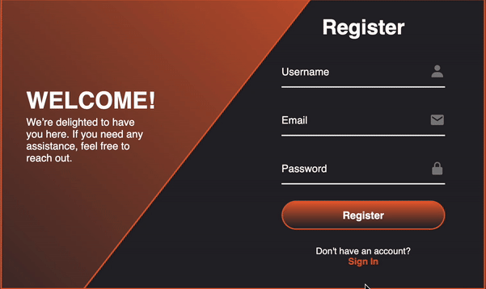

# Animate CSS — Login/Register Form

This repository contains a small HTML/CSS/JS demo of a login/register form with an animated panel. A preview GIF is included below.



## Project structure

- `index.html` — markup for the demo page
- `style.css` — styles, layout and animations
- `script.js` — small JS to toggle forms/interactions
- `login-register.gif` — an animated preview of the demo

## How to view

Option A — Open locally
- Double-click `index.html` (or open it in your browser) to view the demo.

Option B — Serve with a local HTTP server (recommended for some browsers)
- Use any static file server you prefer. For example, if you have Node.js installed you can install a lightweight server and run it:

```bash
# install once (optional)
npm install -g http-server

# serve current directory
http-server -p 8000
```

- Then open `http://localhost:8000` in your browser.

## Browser compatibility

This demo uses basic HTML, CSS and vanilla JS and should work in modern browsers (Chrome, Firefox, Edge, Safari). If styles look off, try updating your browser.

## Credits

Created by you. GIF preview added to the project root.

## License

This repository has no license by default. Add a license file if you want others to reuse the code (for example, MIT).
